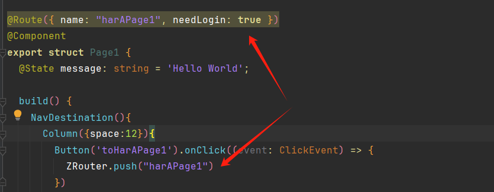
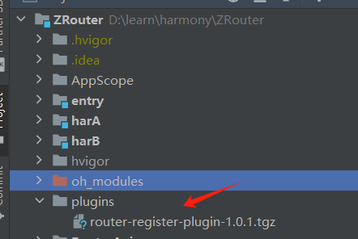
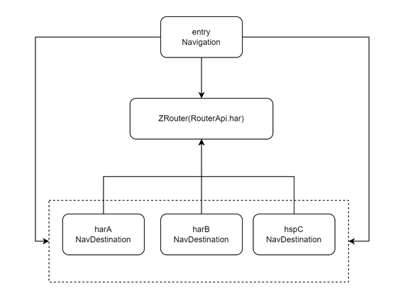
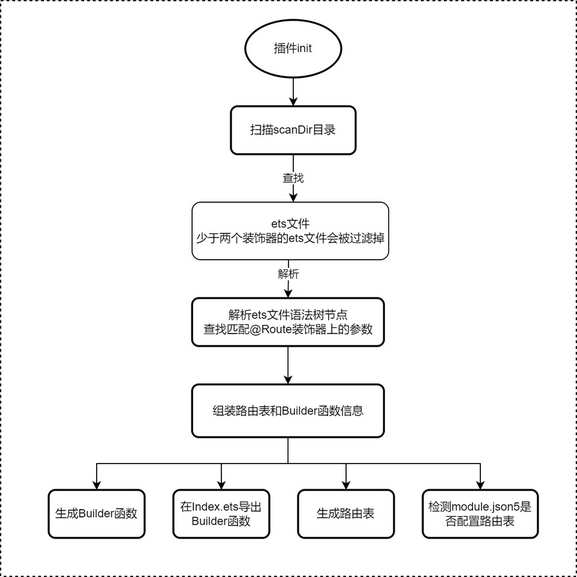

## 介绍


ZRouter是基于Navigation系统路由表和Hvigor插件实现的动态路由方案。

系统路由表是API 12起开始支持的，可以帮助我们实现动态路由的功能，其目的是为了解决多个业务模块（HAR/HSP）之间解耦问题，从而实现业务的复用和功能的扩展。

我们先回顾下系统路由表的使用步骤：

- 首先在目标模块中的module.json5文件中配置路由表文件route_map.json的指引；
- 然后在resources/base/profile目录下创建route_map.json文件，用于配置每个页面路由的信息；
- 接着定义每个页面对应的Builder函数，用此作为页面入口，函数名必须与route_map.json文件中buildFunction字段一一对应，否则会跳转异常。
- 最后通过pushPathByName等路由接口进行页面跳转。


上面的步骤虽然是很简单，但很繁琐；而ZRouter在router-register-plugin插件下支持下，让整个流程更简单化，开发者不用手动去配置，router-register-plugin插件已经将代码模板化，在编译阶段会自动生成配置，帮我们完成整个路由的注册流程。另外ZRouter提供了全局拦截器，可以在页面跳转时进行拦截处理，做重定向或者一些统一操作。

两行代码就可以完成页面的跳转，如下:

<center>



</center>


## router-register-plugin插件的使用

### 下载安装

router-register-plugin插件离线包可以在github或gitee上下载。

- github：https://github.com/751496032/RouterRegisterPlugin/releases
- gitee：https://gitee.com/common-apps/RouterRegisterPlugin/releases


下载后建议放在项目根目录下的单个文件夹中，如下：

<center>


</center>

在hvigor/hvigor-config.json5文件中进行依赖安装，如下：


```
"dependencies": {
  "router-register-plugin":"file:../plugins/router-register-plugin-1.0.1.tgz"
    
}
```

或者安装远程包：


```
  "dependencies": {
//    "router-register-plugin":"file:../plugins/router-register-plugin-1.0.2.tgz"
    "router-register-plugin":"1.0.4"
  },
```


> 版本记录：https://www.npmjs.com/package/router-register-plugin?activeTab=versions


最后记得Sync Now或重新build让插件安装生效。

或者使用hvigorw命令行工具执行任一命令，命令行工具会自动执行安装构建依赖。


```
hvigorw --sync
```

### 初始配置

在每个模块中的hvigorfile.ts文件导入router-register-plugin插件模块的routerRegisterPlugin函数和PluginConfig 接口，routerRegisterPlugin 函数是自定义Hvigor插件的入口函数，PluginConfig是一个配置对象，用于定义插件的行为。


```
import { routerRegisterPlugin, PluginConfig } from 'router-register-plugin'

const config: PluginConfig = {
  scanDir: "src/main/ets/components",
  logEnabled: false,
  viewNodeInfo: false,
}
export default {
    system: harTasks,  
    plugins:[routerRegisterPlugin(config)] 
}

```

上面代码初始化PluginConfig配置对象，包括要扫描的目录（scanDir）和两个布尔属性（logEnabled 和 viewNodeInfo），用于控制日志记录和查看节点信息的功能；然后将配置对象作为参数传入到routerRegisterPlugin入口函数中，最后将routerRegisterPlugin()函数添加到plugins数组中。

- scanDir：建议是页面目录，这样可以更精准扫描目标文件。
- logEnabled：日志记录开关。
- viewNodeInfo：查看节点信息的开关，只有logEnabled和viewNodeInfo同时开启才会生效。

PluginConfig配置对象还有其他属性，但不建议使用，使用默认值即可。如下:


```
export class PluginConfig {
    /**
     * 扫描的目录
     * src/main/ets/
     */
    scanDir: string = ''
    /**
     * builder函数注册代码生成的目录
     * src/main/ets/_generated/
     */
    generatedDir: string = ''
    /**
     * Index.ets目录
     * 模块下目录下
     */
    indexDir: string = ''
    /**
     * module.json5文件路径
     * src/main/ets/module.json5
     */
    moduleJsonPath: string = ''
    /**
     * 路由表路径
     * src/main/ets/resources/base/profile/route_map.json
     */
    routerMapPath: string = ''
    /**
     * 是否打印日志
     */
    logEnabled: boolean = true

    /**
     * 查看节点信息，只有与logEnable同时为true才会打印输出
     */
    viewNodeInfo: boolean = false

}

```
> 上面所有路径都是相对模块的src目录而言的，是相对路径。最后记得Sync Now或重新build让配置生效。

## ZRouter的基本使用

### 下载安装

在每个har/hsp模块中，通过ohpm工具下载安装库：


```
ohpm install @hzw/zrouter
```

或者安装本地har包：


```
ohpm install ../libs/RouterApi.har
```

### 页面跳转

新建三个模块分别是harA、harB、hspC，三者之间没有依赖关系，entry模块依赖了这三个模块，通过ZRouter可以在四个模块间相互跳转，从而达到模块解耦效果。模块关系图如下图：

<center>


</center>


1、在EntryAbility的onCreate()方法中初始化ZRouter


```
onCreate(want: Want, launchParam: AbilityConstant.LaunchParam): void {
    // 如果项目中存在hsp模块则传入true
    ZRouter.init(true)
}

```


2、在Index页面使用Navigation作为根视图，通过ZRouter的getNavStack()方法获取NavPathStack实例。


```
@Entry
@Component
struct Index {

  build() {
    // 获取NavPathStack实例对象
    Navigation(ZRouter.getNavStack()){
      Column({space:12}){
        Button('toHarAMainPage').onClick((event: ClickEvent) => {
        // 跳转页面
          ZRouter.push("harAMainPage")
        })

        Button('toHarBMainPage').onClick((event: ClickEvent) => {
          ZRouter.push("harBMainPage")
        })

        Button('toHspCIndex').onClick((event: ClickEvent) => {
          ZRouter.push("hspCIndex")
        })
        
         Button('tohspCPage1').onClick((event: ClickEvent) => {
          ZRouter.push("hspCPage1")
        })

      }
    }
    .title('Main')
    .height('100%')
    .width('100%')
  }
}
```

通过ZRouter的pushXX()方法进行页面跳转，参数是@Route装饰器上的name属性值。或者用ZRouter的getNavStack()方法来执行页面跳转。

3、在子页的结构体上使用自定义@Route装饰器描述当前页面，其中name属性是必填的，页面跳转需要用到name值，建议使用驼峰式命名，还有另外三个可选属性分别是：

- description：页面描述，没有功能作用；
- needLogin：如果页面需要登录，可以将值设置为true，然后在拦截器中做页面重定向到登录页；
- extra：额外的值可以通过该属性设置

> 自定义@Route装饰器参数只支持字面量值，不支持表达式方式赋值。

代码如下：


```
@Route({ name: 'hspCPage1', needLogin:true ,extra: 'hsp'})
@Component
export struct Page1 {
  @State message: string = 'Hello World';

  build() {
    NavDestination(){
      Column({space:12}){
        Button('toHarAPage1').onClick((event: ClickEvent) => {
          ZRouter.push("harAPage1")
        })

        Button('toHarAPage2').onClick((event: ClickEvent) => {
          ZRouter.push("harAPage2")
        })

        Button('toHarBPage1').onClick((event: ClickEvent) => {
          ZRouter.push("harBPage1")
        })

        Button('toHarBPage2').onClick((event: ClickEvent) => {
          ZRouter.push("harBPage2")
        })

        Button('toHspCPage1').onClick((event: ClickEvent) => {
          ZRouter.push("hspCPage1")
        })

        Button('toHspCPage2').onClick((event: ClickEvent) => {
          ZRouter.push("harCPage2")
        })
      }

    }
    .title('hspCPage1')
    .width('100%')
    .height('100%')

  }
}

```


NavDestination是子页面的根容器，不需要在main_pages文件中注册页面路径。


### 拦截器


#### 全局拦截器

ZRouter提供了拦截器，可以拦截页面进行重定向，可实现如下的效果：

- 在拦截器内可以根据@Route装饰器上的参数来判断是否需要登录，如果需要登录并且没有登录的情况下，可以重定向到登录页面，如果用户完成了登录在返回后，可以设置是否继续执行登录前的页面跳转；
- 在拦截器内可以判断跳转页面是否存在，如果不存在（未注册），也可以进行拦截重定向到一个404页面；

拦截器代码示例：

```
@Entry
@Component
struct Index {
  aboutToAppear(): void {
    ZRouter.addGlobalInterceptor((info) => {
      console.log('GlobalInterceptor: ', JSON.stringify(info.data) , info.needLogin)
      if (info.notRegistered) {
        // 页面不存在，重定向到404页
        ZRouter.redirect("PageNotFound")
        return
      }
      let isLogin = AppStorage.get<Boolean>("isLogin")
      if (info.needLogin && !isLogin) {
        let param = ZRouter.getParamByName(info.data?.name ?? "")
        ZRouter.redirectForResult("LoginPage", param, (data) => {
            if (data.result) {
              // 登录成功
              promptAction.showToast({ message: `登录成功` })
              return true // 返回true 则继续跳转登录前的页面
            }
            return false
          })
      }
    })

  }
    
}
  
```

info.notRegistered()方法判断当前页面是否注册，如果没有注册，将使用ZRouter.redirect() 方法来重定向到404页面；通过ZRouter.redirectForResult() 方法来重定向到登录页面，这个方法接受一个回调函数，该回调函数会在用户登录成功或失败后被调用，在回调函数内部，使用 data.result判断是否登录 ，如果登录成功了给回调函数 return true 来指示继续执行登录前的页面跳转。如果登录失败，或者用户取消登录，回调函数将返回 false，表示不跳转。


登录页面代码示例：


```
@Route({ name: 'LoginPage'})
@Component
export struct LoginPage{

  build() {
    NavDestination(){
       Column({space:15}){
         Button('登录成功').onClick((event: ClickEvent) => {
            // 模拟登录
           AppStorage.setOrCreate('isLogin', true)
           ZRouter.popWithResult("login success")
         })
       }
       .width('100%')
       .height('100%')
    }
      .width('100%')
      .height('100%')
      .title('LoginPage')
  }
}
```

在登录成功后通过ZRouter.popWithResult()方法携带数据关闭页面，此时会将状态传递给redirectForResult()方法的回调函数。


上面是全局拦截器，每个跳转都会触发。

#### 添加与移除拦截器


```
aboutToAppear(): void {
    // 添加拦截器
    ZRouter.addInterceptor('key',(info)=>{
      
    })
}

aboutToDisappear(): void {
    // 移除拦截器
    ZRouter.removeInterceptor('key')
}

```


## 原理

路由注册流程的代码自动化生成，其原理是不难的，就是通过自定义Hvigor插件扫描指定目录的ets文件，递归解析ets文件的语法树节点，查找出自定义装饰器@Route对应的文件，然后解析出装饰器和页面上的信息，最后将这些信息通过模板引擎在编译阶段生成Builder注册函数，路由表配置通过文件读写来写入数据。

> 这与Java 注解处理器APT原理是类似的

ZRouter库是基于NavPathStack的push，pop以及拦截器等接口上进行封装的，NavPathStack简化方法的使用，在拦截器回调中会读取@Route装饰器上的参数并封装回调给外部拦截器使用，因此外部可以根据此信息来做重定向等其他一系列操作。

插件实现流程图：

<center>


</center>

## 交流

如使用有疑问或建议，请在github或gitee上提交issue，或者在微信群中交流(v: 751496032)。


## 源码

- ZRouter
  - github：https://github.com/751496032/ZRouter
  - gitee：https://gitee.com/common-apps/ZRouter

- router-register-plugin插件
    - github：https://github.com/751496032/RouterRegisterPlugin
    - gitee：https://gitee.com/common-apps/RouterRegisterPlugin


## 参考

-  https://gitee.com/harmonyos-cases/cases/tree/master/CommonAppDevelopment/feature/routermodule


